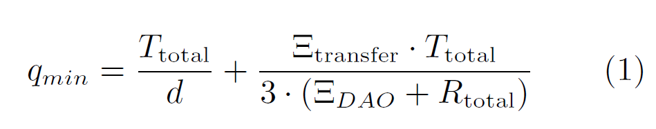
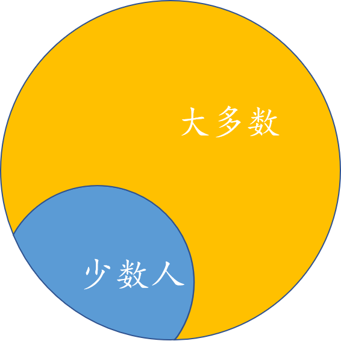

## DAO是什么

DAO是一种新型组织，是Decentralized Autonomous Organization的缩写，“去中心化”是指希望组织内部的成员都有高度的参与性，组织成员地位平等，共同决定组织的发展方向；“自治”是指希望尽可能地减少外界对该组织的干预，让组织内部人员决定组织的发展方向。

## 众筹

众筹是一种募集资金的方式，是指一种向群众募资，以支持发起的个人或组织的行为。

## The DAO

The DAO是一个去中心化的风险投资基金，以智能合约的形式运行在以太坊区块链上。它也是一个盈利性的DAO（去中心化自治组织），它将利用自己掌控的以太币资金通过投资以太坊上的应用为其成员创造收益。

The DAO本质上是一个风险投资基金，通过以太坊筹集到的资金会被锁定在智能合约中，资金是加密数字货币的以太币(Ether)形式。每个参与The DAO众筹的用户按照出资数额，获得相应的DAO代币(token)。拥有DAO代币的用户具有审查项目和投票表决的权利。

如果一个项目（主要针对以太坊上的应用）需要募集资金，其可以向The DAO组织提出投资议案。全体代币持有人对该提议投票表决，如果议案得到足够的票数支持，相应的款项会划给该项目。这时，相当于The DAO组织内的所有会员都投资了该项目，由该项目产生的收益也将由The DAO组织的所有会员共享。

> the DAO和Slok.it的关系：the DAO是一个去中心化的风险投资基金，而Slok.it是一家区块链公司。Slok.it起草了the DAO的白皮书，而the DAO的代码大部分也是由Slok.it实现的

## The DAO 白皮书解读

### 众筹

在The DAO创建期，任何人都可以向它的众筹合约（0xBB9bc244D798123fDe783fCc1C72d3Bb8C189413）发送以太币，获得DAO代币，这就是The DAO的众筹，为期28天（2016年4月30日到2016年5月28日）。前14天1个以太币可以兑换100个DAO代币；中间10天，每个以太币可以换的DAO数量线性减少，最后四天1.5个以太币换100个DAO代币。

上面关于代币数量的计算是参考白皮书中第5章——代币价格 推导出来的。

拥有DAO代币象征着用户加入了The DAO组织，只有拥有DAO代币的会员才具有发起提议、审查项目、投票表决等权利。在众筹结束后，这些代币的所有权可以通过以太坊区块链的交易转移给其他用户。

### 提议

#### 常规提议

提议在the DAO的白皮书中以proposal 或者 offer 表示。

The DAO的每一个会员都可以花费一部分众筹来的以太币来提交提议。如果建议被批准，以太币会发送到另外一个表示提议项目的合约中。

The DAO中的会员会对提议进行投票，一个token代表一票。在投票期（提议者在发起提议时设置，最少为14天）结束之后，统计获得的票数，如果得票超过最少票数，则认为投票通过。最少票数的计算公式如下：

T_total代表The DAO组织一共发行的代币总量
d是调整的系数，初始值为5。按照一定的规则进行调整。
I_transfer代表该提议的提出者提出该提议时花费的以太币，如果该提议通过，则该部分以太币将被转移到该提议对应的合约地址中。
I_DAO代表The DAO组织拥有的以太币数量
R_total代表总的奖励代币

每一个提议的表现形式都是一个智能合约，the DAO项目中有一个示例提议 https://github.com/TheDAO/DAO-1.0/blob/master/SampleOffer.sol

#### 分裂提议

如果在DAO组织中，某个或某些会员由于不满其所在的DAO组织，希望取回他们的资金，他们可以提交一个特殊的提议来形成一个新的DAO，这个特殊的提议叫做分裂提议。

与常规提议不同的是，分裂提议需要押金支付。这一点是为了防止攻击者为了阻止分裂而将押金修改的非常高。

分裂提议的投票期只有7天，比常规提议的最短投票期都要少7天。这样设计是为了允许任何不同意某项提议的会员都能及时地分裂出去，从而保护自己的资产。

### 投票

DAO的成员投票权重由他们掌握的代币数量来决定。代币是可分割，无差别的，可以方便的在用户之间进行转移。在合约中，成员的个人行为不能被直接确定。任何提议都需要一个时间范围去讨论和投票。

在超过该时间范围之后，代币的持有者可以调用一个DAO合约中的函数来验证大多数的投票是支持提议的并达到了法定人数。如果是这种情况，提议将会执行；如果不是这种情况，提议将会关闭。

### 分割DAO

如果在DAO组织中，某个或者某些代币持有者（下文中称为“少数人”），非常反对某项提议，在某项提议执行前想要取回他们的资金，他们可以提交一个特殊的提议来形成一个新的DAO。“少数人”可以投票将他们的资金转移到这个新的DAO中，使得剩下的“多数人”只能花费他们自己的钱。

如果你需要简单的兑现，或许你应该想考虑到交易所交易DAO代币，而不是分割。

在the DAO的智能合约中，使用splitDAO函数来完成DAO组织的分割的。该函数是黑客入侵的入口函数，在下面我会详细解释。

### 服务提供商

服务提供商在白皮书中使用curator表示。

每一个单独的DAO都对应着一个单独的服务提供商，这个服务提供商控制着一个唯一的账号，通过提议可以从DAO中接受。另外，服务器提供商可以创建DAO可以发送金额的白名单地址。这给了服务提供方非常大的权力。 为了防止滥用这种权力，DAO可以投票选择新的服务提供方。

## 如何分割DAO

> 在上面已经提到过DAO的分割，但是DAO的分割太重要了，黑客就是利用DAO分割中一个错误完成的攻击。所以我们再次细细研究以下DAO的分割

分割DAO 是指token 的所有者调用splitDAO函数，将自己持有的eth和token从原有的DAO中取出，并转到一个新的dao的过程。

分割DAO的流程如下：
1.	分割DAO的详细步骤如下所示：
2.	新建一个提议用来分割DAO（调用DAO.sol中的newProposal()函数）。
3.	找到提议的ID（第3步投票、和第5步分隔DAO的时候需要用到提议的ID）。
4.	对你的提议投“YES”（调用DAO.sol中的vote函数）。
5.	等待若干天的辩论期（该天数取决于你在新建提议时，在“Debating Period”里指定的时间，不得少于7天）。
6.	调用DAO.sol中的splitDAO()函数完成分割。现在你将正式地分割你的以太币和奖励代币，你不在是原DAO的一份子了。
7.	找到你的新的DAO地址，增加新的Watch Contract & Watch Token。
8.	等待27天的新的分割DAO的众筹期。
9.	将你的地址增加到白名单。
10.	新建提议发送所有的以太到这个地址。
11.	对这个提议投Yes。
12.	等待14天的投票期。
13.	执行提议。“现在你的以太币已经被发送到这个指定的地址了”。
