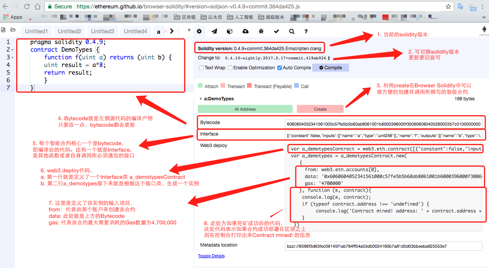
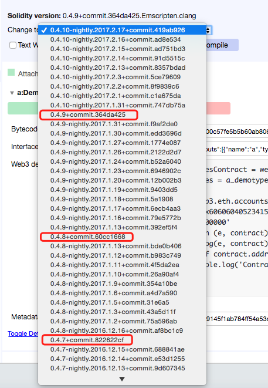
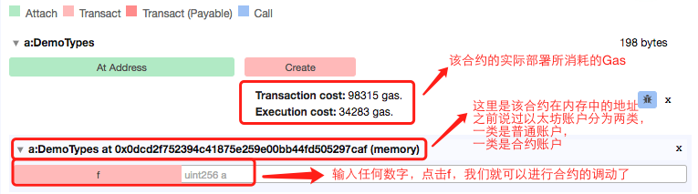

1. 当前的solidity版本，如上图截图所示为0.4.9，这个默认用的是当前最新的release版本。

2. 点击下拉框，可以选择不同的版本，包括还未成熟的最新构建版本，或者是之前的版本等。 个人强烈建议，尽量选择release版本，如下图所示的这些

3. 点击create,会在内存中将该智能合约创建一个实例，即将下面的web3 deploy代码部署在虚拟的内存中。

4. bytecode是源代码的编译产物，这个也是最终会被放到区块链上的标识。任何在网络里的人都可以读到这段bytecode.

5. interface 是智能合约除了bytecode之外的另一个核心，他是该智能合约和外界沟通的核心

6. web3.deploy 代码，是可以直接部署在geth网络上的一段部署代码，在上一章中，我们已经试过了，只要复制黏贴这段代码，就可以直接在一个区块链私有链上进行部署，并且调用他。

7. 一些参数

* from 代表合约由哪个账户生成：那个账户生成，则生成所需的gas就需要该账户承担，默认为eth.accounts[0],因为所有的挖矿所得的以太币也默认都存入该账户中区。 

* data: 代表的就是bytecode gas: 代表的是为了部署该合约最多准备的gas数量，当然实际上可能用不了这么多gas，具体消耗以实际使用量为准，这里只是设定一个最大量。

8. 最后这段是一个典型的javascript的异步调用的写法，将上面的new方法的结果传递给下一个方法 function（e,contract) 在下一个方法中处理如果挖矿成功的显示结果。