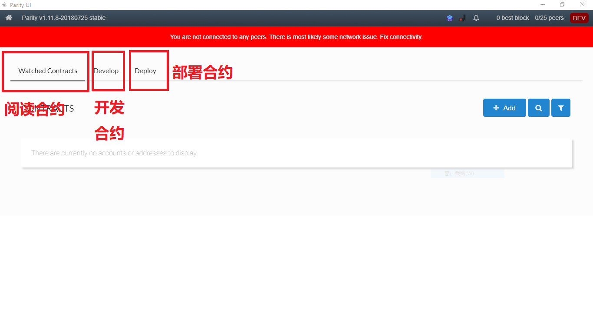
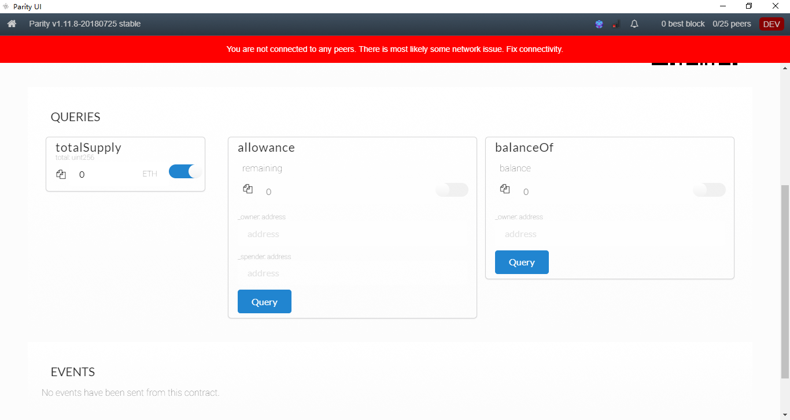
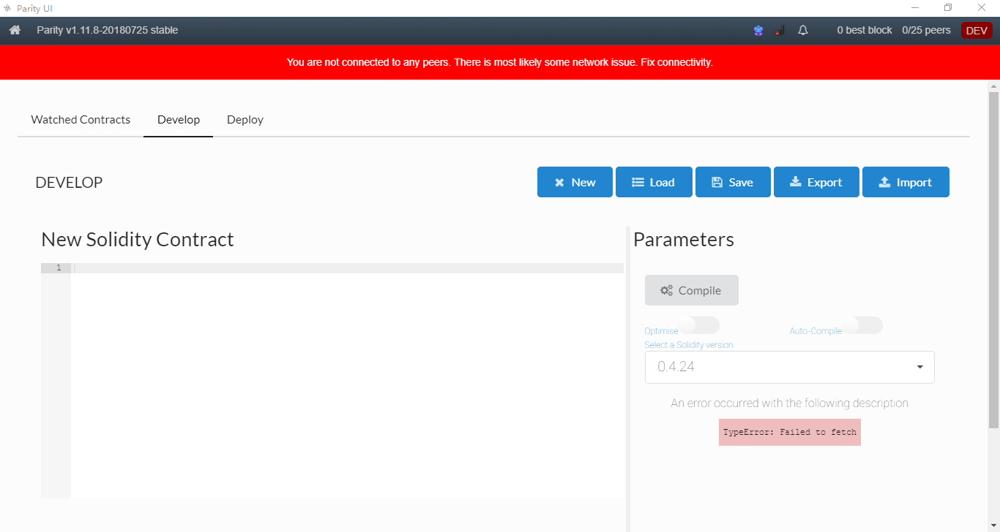

> Parity由Rust语言编写，Dr. Gavin Wood主导完成，Dr. Gavin Wood是以太坊黄皮书的作者。

parity现在分流为两个项目：
parity：https://github.com/paritytrading/parity
parity UI: https://github.com/Parity-JS/shell/releases

两个项目需要配合使用

# 生成安全token

```bash
D:\Program Files\Parity Technologies\Parity>parity signer new-token

Open: http://127.0.0.1:8180/#/auth?token=GMDK-EwHc-3j6n-GHhY
to authorize your browser.
Or use the generated token:
GMDK-EwHc-3j6n-GHhY
```

# 启动链

私链

```bash
parity --chain dev
```

默认会创建一个非常多ETH的账号，无须密码，然后可以在同事创建很多账号去做开发测试用。

----------------------

测试链

```bash
parity --chain kovan
```

-----------------------------------

主链

```bash
parity
```

启动测试链和主链之后将会自动开始同步区块

# 启动parity UI

根据你启动的链的不同，启动parity UI之后进入的页面也不同，右上角分别是

DEV 私有网络

KOVAN 公开测试网络

FOUNDATION 主网

# 操作合约

点击首页的Develop Contracts



## 查看合约

以波场为例，
1. 选择Watched Contracts
2. 选择ERC20的token
3. 输入波场的地址和名字

```bash
0xf230b790e05390fc8295f4d3f60332c93bed42e2
Tronix 
```



parity把合约的public变量和读接口都直接展现出来，变量可以直接浏览其数值，接口可以传入参数去执行。这样可以非常方便地看到合约的状态。操作一下，感受一下，是不是要比remix看得清晰太多，那玩意儿是在太难用。


## 合约开发



整个界面分两块：

左边可以直接开发合约，也可以把开发好的合约粘贴过来。一般是后者了，上篇我们讲过，用vscode做编辑器开发合约。开发好的合约贴过来就行。

右边的上角主要是一些功能按钮，下面的主要区域是编译选型，我们一般需要勾选优化选型，选择正确的sloc版本。


编译成功之后， 可以看到右边如上：

1. 如果有多个合约，需要选择一个想部署的。此处是因为合约存在继承关系，但最终需要把这些合约放在一起编译，否则就会出现找不到的情况。可以通过truffle-flattener解决这个问题。truffle神奇好用的地方，充分体现。当初我正发愁的时候，发现已经有完美的解决方案。具体大家可以搜索学习，此处不做进一步阐述。

2. ABI：就是合约的一个接口展示。


3. Bytecode：就是合约的二进制码。如果合约没有开源，看到的就是这么一堆东西。
我们选择正确的合约，直接点击 DEPOLY 指令.


# 利用parity学习fomo3d

1. 获取f3dlong合约地址，在etherscan上浏览起代码, 地址如下：
https://etherscan.io/address/0xa62142888aba8370742be823c1782d17a0389da1#code


2. 通过上面的代码，我们获取合约的地址和ABI接口

3. 进入parity的合约界面，点击watch：

4. 选择 Custom Contract, 点击右下角的下一步：

5. 正确的合约地址，命名，和ABI接口


6. 点击 ADD CONTRACT

7. 进入合约主界面

8. 点击合约进入


