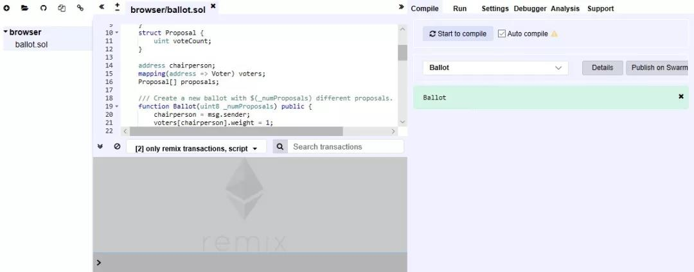
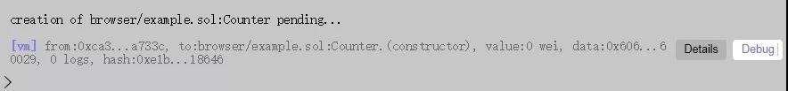
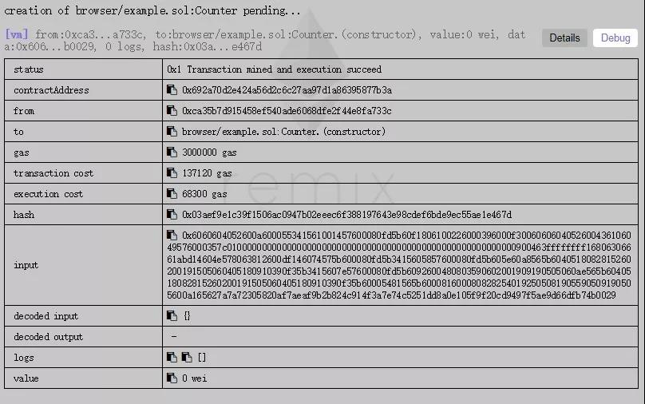
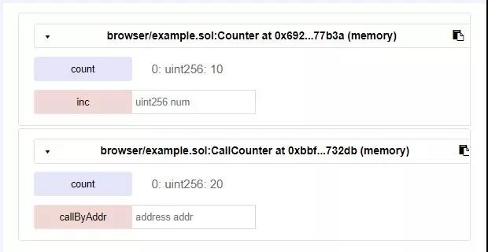
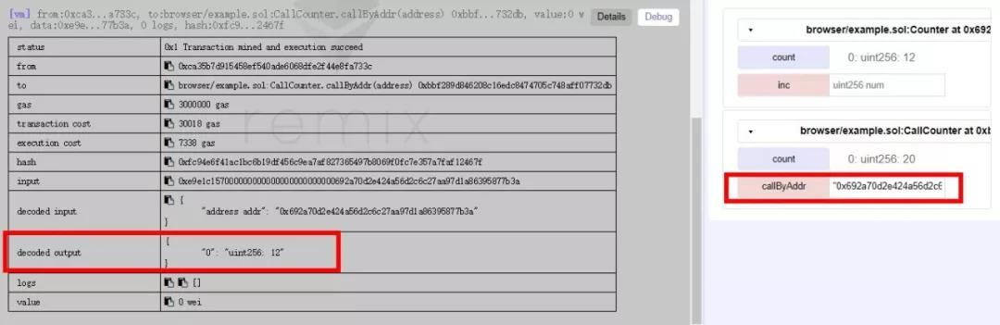
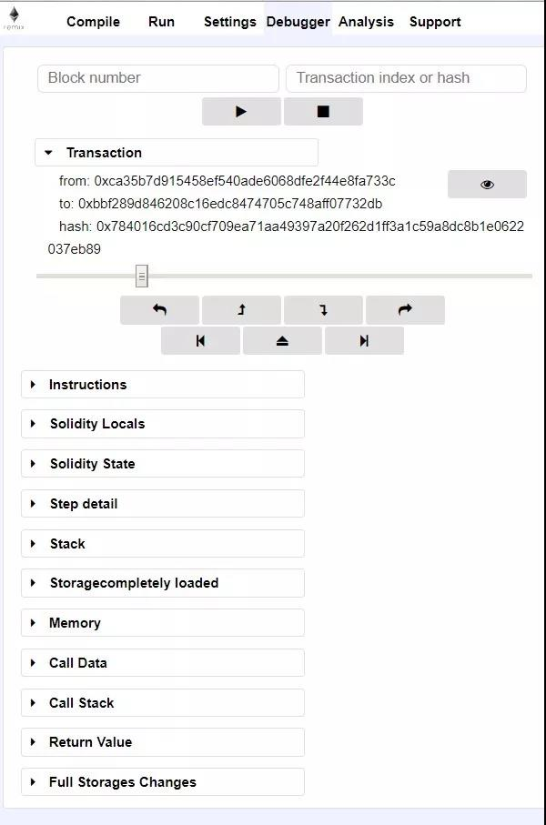

# Remix详解

> 一个Solidity程序被编译器编译成十六进制字节码（EVM Code）后，下一步可以进行部署和测试。通常，先把智能合约部署到测试环境（测试链https://testnet.etherscan.io/ 或者开发者自己搭建私有链）上进行测试，没有问题后才会发布到以太坊公链。任何程序都有可能出现漏洞，未经测试的智能合约直接部署到以太坊公链上或者是其他生产环境的区块链上，后果都是严重的。

> 以太坊官方社区还开发了Solidity智能合约的集成开发环境（IDE）：Mix和Remix。不过Mix项目已经停止继续维护和开发。Remix（也叫Browser-Solidity）是一个基于浏览器的Solidity编译器和集成开发环境，提供了交互式界面，提供编译、调用测试、发布等一系列功能，十分方便使用


# Remix界面

以太坊官方不仅提供了Remix的开源代码，开发者可以同步代码到本地，搭建起自己的基于浏览器的Solidity IDE，还提供了Remix的在线网站（http://remix.ethereum.org/）。  开发者甚至都不需要自己安装，直接在浏览器里访问网站，就可以进行开发、编译、调试、测试等工作。图5-1就是目前Remix最新版本的界面。



界面左侧为文件列表；中间上方为智能合约代码编辑器，下方为命令行终端；界面右侧为调试工具栏。

（1）文件列表

文件列表中显示所有在Remix中打开的文件，列表上方的按钮从左至右依次为添加新文件，添加本地Solidity源代码到Remix页面，将Remix中打开的文件发布到github，将Remix中打开的文件传入另一个Remix页面，连接本地服务器。

（2）Solidity编辑器

编辑器上方将所有打开的智能合约文件以标签的形式展示。编辑器左侧的边框上会在对应的行号旁边提示出编译警告和错误。Remix的编辑器还会自动保存当前状态的文件。左上角的加减号还可以让用户调整字体大小。

（3）调试工具栏

调试工具栏上方选项卡从左至右依次为编译（Compile）、执行（Run）、编译设置（Settings）、调试工具（Debugger）、代码分析（Analysis）、讨论区（Support）。在编译选项卡中可以勾选“自动编译”（Auto compile）或手动执行编译，同时包含编译警告或错误信息。执行选项卡中可以部署编译好的智能合约代码或调用已部署的智能合约。编译设置选项卡中可以选择Solidity编译器的版本和优化选项。调试工具用于调试智能合约（之后将详细介绍）。Remix提供基于代码的静态分析，会对一些涉及到安全性问题的代码片段进行提示，在“代码分析”中可以设置是否进行这些提示。

（4）命令行终端

Remix的命令行工具集成了JavaScript的解释器。而且在injected Web3和Web3 provider两种环境下，还提供直接可用的“web3”对象。（环境设置在调试工具栏->Run->Environment里进行选择）。用户可以在命令行工具里编写简单的JavaScript脚本。另外命令行终端还会显示出用户用来部署或调用智能合约的交易Transaction信息，如图5-2所示。



在交易Transaction的右侧，有两个按钮：Details（详情）和Debug（调试）。点击Details按钮，将显示交易回执的详细信息，如图5-3所示。



图5-3中展示的回执信息中，不仅包含from，to，gas，hash等Transaction的基本信息，还包含contract address，decode output，logs这些与Transaction执行结果有关的字段。

点击Debug按钮，可以对这个Transaction的执行过程进行调试。下一节将介绍Remix基本的调试过程。

# Remix调试

以上介绍了Remix界面上的基本元素，下面将展示如何用Remix进行调试。首先我们定义两个简单的智能合约Counter和CallCounter，代码如下。Counter合约中有一个公共变量count，以及一个函数inc(uint num)，可以将count变量的值叠加上num。CallCounter合约中也有一个公共变量count，还有一个callByAddr(address addr)函数，其中调用了Counter合约的inc(uint num)函数。


```javascript
contract Counter
{
    uint public count = 10;
    function inc(uint num) public returns (uint)
    {
        return count += num;
    }
}
contract CallCounter
{
    uint public count = 20;
    function callByAddr(address addr) public returns (uint)
    {
        return Counter(addr).inc(2); // 通过Counter合约的地址进行调用
    }
}
```


接下来在右侧调试工具栏中，选择“Run”标签页，先选择智能合约Counter，点击Create进行创建。图5-2、图5-3即为部署Counter合约的Transaction的回执信息。接着以同样的方式部署CallCounter。

部署好2个智能合约后，在右侧“Run”标签页可以找到这两个智能合约，以及每个智能合约对应的公共（public）变量和函数，如图5-4所示。其中，字样为“count”的按钮对应的是公共变量count默认对应的constant函数，点击后Remix可以通过eth_call来获取count变量的值。字样为“callByAddr” 按钮对应合约的公共函数callByAddr(address addr)，可以在其右侧的输入框中指定参数addr。点击该函数按钮后，Remix根据对应的合约函数及参数，生成一条Transction并使用eth_sendTransaction的方式来调用改函数。



接下来我们调用CallCounter的callByAddr函数。在执行选项卡（Run）下将Counter的地址（在图5-3中的Transaction回执信息里可以找到contractAddress）,填入CallCounter的callByAddr参数中，然后点击该函数。

在调用callByAddr函数的Transaction的回执详情中可以看到，callByAddr的返回值为12（即Counter的inc函数的返回值），如图5-5所示。点击Details旁边的Debug按钮，调试工具栏将切换到Debugger这一栏（见图5-6），用户可以调试这一条Transaction。





在图5-6的调试页界面上，从上至下依次为：
1. 交易信息（Transaction）
2. 交易调试进度条与调试按钮
3. 当前执行的智能合约的底层代码（Instructions）
4. 当前执行函数的局部变量信息（Solidity Locals）
5. 当前智能合约的全局变量信息（Solidity State）
6. 当前执行步骤的具体信息（Step Detail）
7. 当前EVM的栈状态（Stack）
8. 当前智能合约的存储状态（Storagecompletely loaded）
9. 当前智能合约的内存状态（Memory）
10. 调用当前智能合约的传入数据（Call Data）
11. 智能合约调用栈（Call Stack）
12. 智能合约返回值（Return Value）
13. 智能合约存储修改（Full Storages Changes）

