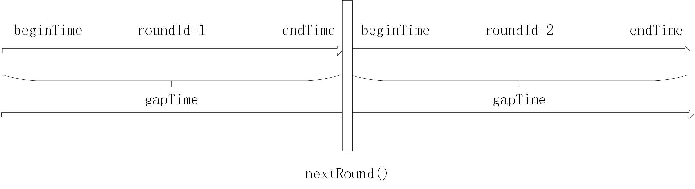
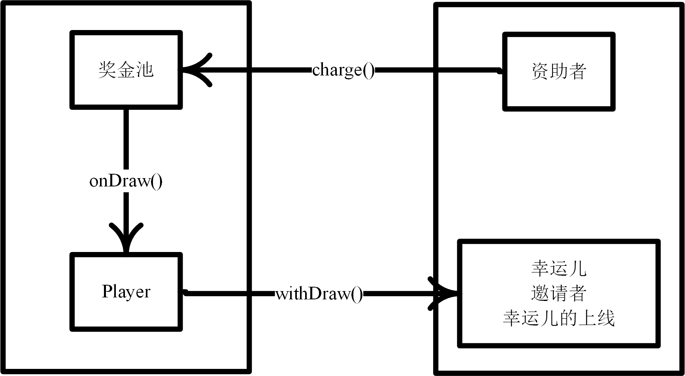
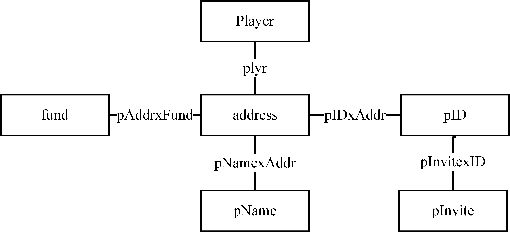

# 天天抽ETH

网址：  http://freeeth.club/#!/main/

合约地址:  https://etherscan.io/address/0x5ec28acd52fcdb9be4370d13d8fe3879cc9f5c22#code

# 游戏轮次

# eth的流向

# mapping

# modifier

isHuman: 调用者必须是外部账户而不能是合约账户

payable：调用该函数的交易可以带上eth

havePlay：至少有一个玩家参与本轮游戏

haveFund：奖金池中必须有eth

# event

## RoundStop

一轮游戏结束

记录的信息：

roundId\_: 本轮游戏的id

## Result

一次开奖的结果

记录的信息：

roundId\_:  本轮游戏的id

endTime\_: 结束时间

\_amount: 

\_winnerAddr: 幸运儿的地址

\_winnerValue: 幸运儿获得eth数目

\_mostInviteAddr: 邀请王的地址

\_mostInviteValue: 邀请王获得eth数量

\_laffAddr: 幸运儿的上线的地址

\_laffValue: 幸运儿的上线获得的eth数目
# 结构体

Player：玩家结构体

addr：地址

vault：余额

totalVault：余额

laff：谁邀请的该用户

joinTime：加入时间

drawCount：参与抽奖的次数

remainInviteCount：还没用的（指没有利用这次邀请去抽奖）邀请次数

InviteDraw：

selfDraw：

inviteCode：邀请码

inviteCount：

newInviteCount：

InviteTS：

# constructor

构造函数，初始化第一轮游戏的beginTime和endTime，将全局变量roundId\_ = 1，将全局变量owner\_置为部署该合约的用户。

# function

## determineNewRoundMostInviter

功能：获得本轮中邀请最多的玩家

输入：

pid：用户的id

times：该用户邀请的人数

输出：无。更新newMostInviter和newMostInviteTimes

## joinDraw

功能：参与抽奖

输入：

\_affCode: 

## charge

功能：向奖金池充值ETH

输入：无

输出：无。更新奖金池中的奖金总数fund_

## setParam

功能：设置每日限额（奖池中最多可以有多少eth）

输入：

dayLimit：新的每日限额

输出：无。更新每日限额

## joinCount

功能：获得参与本轮游戏的玩家个数

输入：无

输出：参与本轮游戏的玩家个数

## random

功能：获得一个随机的uint256值

输入：无

输出：一个随机的uint256值

## onDraw

功能：开奖，只有管理员可以触发该函数

输入：无

输出：无。会触发一个Result事件，将开奖结果记录到区块链中。

## nextRound

功能：开启下一轮游戏

输入：无

输出：无

## withDraw

功能：用于将自己账户中的钱（只是在天天抽ETH的服务器中记录的）取到自己的以太坊地址中

输入：无

输出：如果成功，则输出true；如果失败，则输出false。

## getRemainCount

功能：获得某地址对应的Player剩余的抽奖次数

输入：

addr：地址

输出：该地址对应的Player还可以抽多少次奖

